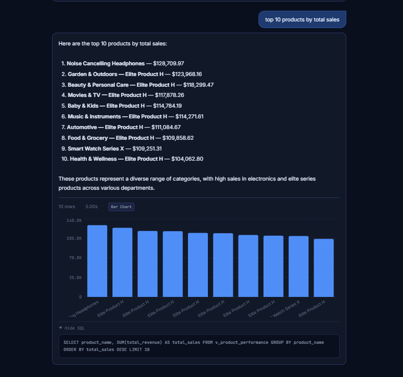

# AI Data Agent

A full-stack natural language data querying tool. Ask questions about your business data in plain English and get answers as charts, tables, or stat cards — powered by an OpenAI agentic loop that writes and executes SQL on your behalf.



     

---

## What it does

- Type any question — *"What is the monthly revenue trend?"*, *"Which products have the highest profit margin?"*, *"How many platinum customers do we have?"*
- The AI agent inspects the schema, writes a SQL query, executes it, and returns a structured answer
- The frontend automatically picks the best visualisation: bar chart, line chart, stat card, or table
- Results are cached in Redis so repeated questions are instant
- Every response shows the exact SQL that was executed (expandable panel)

---

## Tech stack

### Backend

| Layer               | Technology                                  |
| ------------------- | ------------------------------------------- |
| API framework       | FastAPI 0.136 + Uvicorn                     |
| Language            | Python 3.13                                 |
| AI / LLM            | OpenAI GPT-4o (tool-use / function calling) |
| Database driver     | asyncpg (async PostgreSQL)                  |
| Caching             | Redis 8 via redis-py                        |
| Config / validation | Pydantic v2 + pydantic-settings             |
| Package manager     | uv                                          |
| Tests               | pytest + pytest-asyncio + httpx             |

### Frontend

| Layer       | Technology                         |
| ----------- | ---------------------------------- |
| Framework   | React 18 + TypeScript              |
| Build tool  | Vite 5                             |
| Styling     | Tailwind CSS 3 (custom dark theme) |
| Charts      | Recharts 2                         |
| Tables      | TanStack Table v8                  |
| HTTP client | Axios                              |

### Infrastructure

| Service                 | Technology                   |
| ----------------------- | ---------------------------- |
| Database                | PostgreSQL 16 (Docker)       |
| Cache                   | Redis 8 (Docker)             |
| DB admin                | pgAdmin 4 (Docker, dev only) |
| Container orchestration | Docker Compose               |

---

## Project structure

```
ai-data-agent/
│
├── backend/                        # FastAPI application
│   ├── main.py                     # App entry point, CORS, lifespan hooks
│   ├── pyproject.toml              # Python dependencies (managed by uv)
│   │
│   ├── agents/                     # AI agent logic
│   │   ├── sql_agent.py            # Main agentic loop (orchestrates tool calls)
│   │   ├── base_agent.py           # OpenAI client setup
│   │   └── tools/
│   │       ├── get_schema.py       # Tool: fetch database schema
│   │       └── run_sql.py          # Tool: validate and execute SQL
│   │
│   ├── api/v1/                     # HTTP endpoints
│   │   ├── chat.py                 # POST /api/v1/chat
│   │   ├── health.py               # GET  /api/v1/health
│   │   ├── schema.py               # GET  /api/v1/schema
│   │   └── router.py               # Route registration
│   │
│   ├── core/                       # App-wide concerns
│   │   ├── config.py               # Settings from .env (pydantic-settings)
│   │   ├── exceptions.py           # Custom exception types
│   │   ├── logging.py              # Structured logging config
│   │   └── security.py             # SQL validation, rate limiting
│   │
│   ├── db/                         # Database layer
│   │   ├── connection.py           # asyncpg connection pools (admin + readonly)
│   │   ├── query_runner.py         # Executes SELECT queries via readonly pool
│   │   ├── sql_validator.py        # Blocks non-SELECT SQL before execution
│   │   └── repositories/           # Data access objects (customers, orders, products)
│   │
│   ├── models/                     # Pydantic request/response models
│   │   └── chat.py                 # ChatRequest, ChatResponse, HealthResponse
│   │
│   ├── services/                   # Business logic layer
│   │   ├── chat_service.py         # Orchestrates cache → agent → format flow
│   │   ├── formatter_service.py    # Decides visualisation type from data shape
│   │   ├── cache_service.py        # Redis get/set with TTL
│   │   └── schema_service.py       # Fetches and caches database schema text
│   │
│   └── tests/
│       ├── unit/                   # SQL validator, formatter logic
│       └── integration/            # Chat endpoint, agent tests
│
├── frontend/                       # React application
│   ├── src/
│   │   ├── App.tsx                 # Root component
│   │   ├── api/client.ts           # Axios instance + API functions
│   │   ├── hooks/useChat.ts        # Message state, submit, clear
│   │   ├── types/chat.ts           # TypeScript interfaces
│   │   ├── lib/formatters.ts       # Number, date, value formatters
│   │   │
│   │   └── components/
│   │       ├── Header.tsx          # App bar with health indicator + New Chat
│   │       ├── ChatInput.tsx       # Auto-resize textarea, keyboard shortcuts
│   │       ├── EmptyState.tsx      # Landing page with example questions
│   │       ├── MessageList.tsx     # Scrollable conversation history
│   │       ├── MessageGroup.tsx    # User bubble + AI response pair
│   │       ├── ThinkingCard.tsx    # Animated loading state
│   │       ├── ResponseCard.tsx    # AI answer + meta + SQL panel
│   │       └── visualisations/
│   │           ├── StatCard.tsx    # Single number display
│   │           ├── BarChartView.tsx
│   │           ├── LineChartView.tsx
│   │           ├── DataTable.tsx   # Sortable table with Copy + CSV export
│   │           └── index.tsx       # Visualisation router
│   │
│   ├── tailwind.config.ts          # Custom dark colour palette
│   └── vite.config.ts
│
├── database/
│   ├── schema.sql                  # Tables, views, indexes
│   ├── 02_create_readonly_user.sh  # Creates the agentreadonly Postgres role
│   └── seeds/seed.py               # Generates realistic fake data with Faker
│
├── docker-compose.yml              # Base: Postgres + Redis + pgAdmin
├── docker-compose.dev.yml          # Dev overrides: port mappings, volumes
├── dev.sh                          # CLI wrapper: up / down / clean / logs / ps
└── .env.example                    # Environment variable template
```

---

## How the AI agent works

```
User question
     │
     ▼
┌─────────────────┐
│  Cache check    │  Redis — return immediately on hit
└────────┬────────┘
         │ miss
         ▼
┌─────────────────────────────────────┐
│           Agentic loop              │
│                                     │
│  1. Send question + system prompt   │
│     to OpenAI GPT-4o with tools     │
│                                     │
│  2. AI calls get_schema()           │
│     → returns table/column info     │
│                                     │
│  3. AI calls run_sql(sql)           │
│     → SQL validator checks it       │
│     → readonly pool executes it     │
│     → rows returned to AI           │
│                                     │
│  4. AI writes natural language      │
│     answer from the results         │
└────────┬────────────────────────────┘
         │
         ▼
┌─────────────────┐
│  Formatter      │  Decides: table / bar_chart / line_chart / stat_card
└────────┬────────┘
         │
         ▼
┌─────────────────┐
│  Cache write    │  Store result in Redis with TTL
└────────┬────────┘
         │
         ▼
    JSON response → React frontend renders visualisation
```

**Security:** The AI only has access to a `SELECT`-only Postgres role (`agentreadonly`). A SQL validator additionally blocks any query containing `INSERT`, `UPDATE`, `DELETE`, `DROP`, `TRUNCATE`, or `--` before it reaches the database.

---

## Database schema

The demo database ships with five tables and four pre-built views:

**Tables:** `customers` · `categories` · `products` · `orders` · `order_items`

**Views:**

| View                      | Description                                    |
| ------------------------- | ---------------------------------------------- |
| `v_order_details`       | Orders with full customer and product details  |
| `v_monthly_revenue`     | Revenue, cost, and profit grouped by month     |
| `v_product_performance` | Sales count and profit per product             |
| `v_customer_summary`    | Customer profiles with lifetime value and tier |

---

## Getting started

### Prerequisites

- Docker Desktop
- Python 3.13 + [uv](https://docs.astral.sh/uv/)
- Node.js 18+ + npm
- OpenAI API key

### 1. Clone and configure

```bash
git clone https://github.com/your-username/ai-data-agent.git
cd ai-data-agent
cp .env.example .env
# Edit .env — set OPENAI_API_KEY and all passwords
```

### 2. Start infrastructure

```bash
./dev.sh up
# Postgres → localhost:5433
# Redis    → localhost:6380
# pgAdmin  → http://localhost:5050
```

> **Note:** If you already have Postgres running on port 5432 or Redis on 6379, the dev compose remaps to 5433 and 6380 respectively. Update `POSTGRES_PORT=5433` and `REDIS_PORT=6380` in your `.env`.

### 3. Seed the database

```bash
cd backend
uv run python ../database/seeds/seed.py
```

This generates ~500 customers, ~1 000 products, and ~5 000 orders with realistic data.

### 4. Start the backend

```bash
cd backend
uv run uvicorn main:app --reload --port 8000
```

API docs available at [http://localhost:8000/docs](http://localhost:8000/docs)

### 5. Start the frontend

```bash
cd frontend
npm install
npm run dev
# App → http://localhost:5173
```

---

## Environment variables

| Variable                       | Description                           | Default           |
| ------------------------------ | ------------------------------------- | ----------------- |
| `OPENAI_API_KEY`             | Your OpenAI API key                   | —                |
| `OPENAI_MODEL`               | Model to use                          | `gpt-4o`        |
| `POSTGRES_HOST`              | Postgres host                         | `localhost`     |
| `POSTGRES_PORT`              | Postgres port                         | `5432`          |
| `POSTGRES_DB`                | Database name                         | `agentdb`       |
| `POSTGRES_USER`              | Admin user                            | `agentuser`     |
| `POSTGRES_PASSWORD`          | Admin password                        | —                |
| `POSTGRES_READONLY_USER`     | Read-only user for the AI             | `agentreadonly` |
| `POSTGRES_READONLY_PASSWORD` | Read-only user password               | —                |
| `REDIS_HOST`                 | Redis host                            | `localhost`     |
| `REDIS_PORT`                 | Redis port                            | `6379`          |
| `REDIS_CACHE_TTL`            | Query result cache duration (seconds) | `3600`          |
| `SECRET_KEY`                 | JWT signing key (future auth)         | —                |
| `MAX_ROWS_PER_QUERY`         | Hard cap on rows returned             | `1000`          |

---

## API endpoints

| Method   | Path               | Description                            |
| -------- | ------------------ | -------------------------------------- |
| `POST` | `/api/v1/chat`   | Submit a natural language question     |
| `GET`  | `/api/v1/health` | Health check (Postgres + Redis status) |
| `GET`  | `/api/v1/schema` | Returns the current database schema    |

### Chat request / response

```json
// POST /api/v1/chat
{ "question": "What is the monthly revenue for the last 6 months?" }

// Response
{
  "success": true,
  "answer": "Revenue has grown from $42K in January to $78K in June...",
  "visualisation": "line_chart",
  "columns": ["month", "revenue"],
  "rows": [{ "month": "2025-01", "revenue": 42150.00 }, ...],
  "row_count": 6,
  "cached": false,
  "execution_time_ms": 1842.3,
  "sql_executed": "SELECT DATE_TRUNC('month', ordered_at) AS month, SUM(total_amount) AS revenue FROM v_order_details WHERE ordered_at >= NOW() - INTERVAL '6 months' GROUP BY 1 ORDER BY 1"
}
```

---

## Development commands

```bash
# Infrastructure
./dev.sh up           # start Postgres + Redis + pgAdmin
./dev.sh down         # stop all containers
./dev.sh clean        # stop + wipe all data (destructive)
./dev.sh logs         # tail all container logs
./dev.sh ps           # show container status

# Backend
uv run uvicorn main:app --reload --port 8000   # start with hot reload
uv run pytest tests/unit/                       # unit tests
uv run pytest tests/integration/               # integration tests

# Frontend
npm run dev           # start Vite dev server
npm run build         # production build (tsc + vite build)
```

---

## Roadmap

These features are planned for future iterations:

### Authentication

- JWT-based login with access and refresh tokens
- Protected routes on the frontend (login page before chat)
- Per-user query history

### Frontend improvements

- **Conversation persistence** — save and reload past sessions from local storage or the database
- **Follow-up questions** — send conversation context to the AI for multi-turn analysis
- **Chart customisation** — toggle between chart types, change axes
- **Dark / light theme toggle**
- **Mobile-responsive layout**
- **Streaming responses** — stream the AI answer token by token instead of waiting for the full response

### Backend improvements

- **Multi-step query decomposition** — break complex questions into sub-queries automatically
- **Query history endpoint** — store every executed query with timing and result metadata
- **Webhook support** — trigger data refreshes from external systems
- **Multi-database support** — connect to MySQL, BigQuery, or Snowflake in addition to Postgres

### Infrastructure

- Production Docker Compose with Nginx reverse proxy
- GitHub Actions CI pipeline (lint, type-check, test)
- Deployment guide for Railway / Render / fly.io

---

## License

MIT
